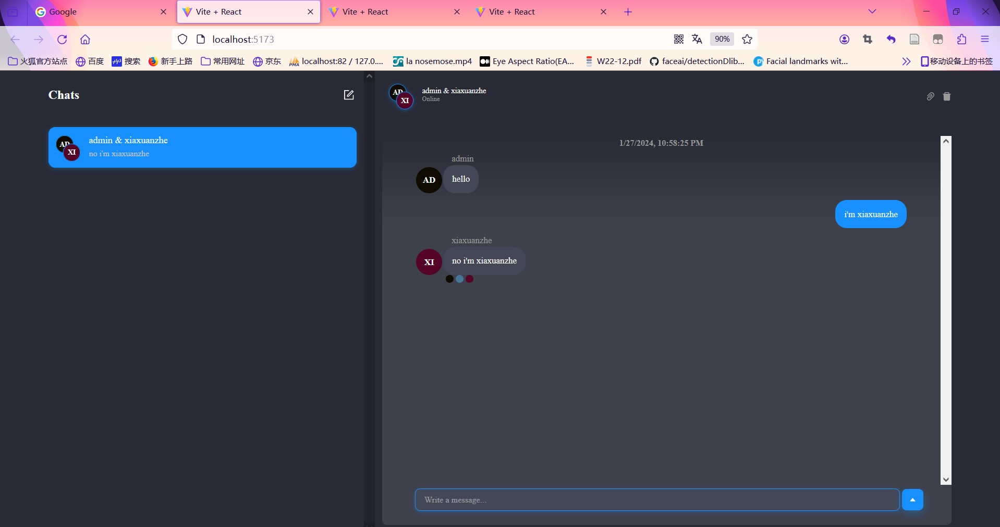
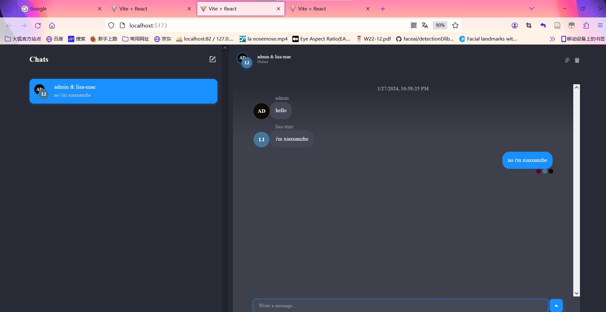
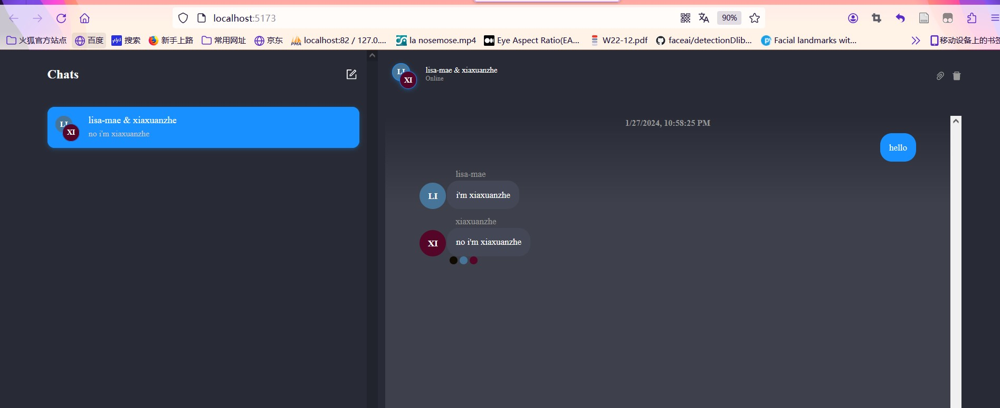

# Projet Chat

## backend
Express, cors, plug-in(vs code:REST Client)
https://chatengine.io/

## frontend
React, Javascript, axios
https://www.npmjs.com/package/react-chat-engine-advanced
https://www.npmjs.com/package/react-chat-engine-pretty

it's a interesting project.
**reference document**：https://blog.chatengine.io/fullstack-chat/express-reactjs

./backend: npm run start
.frontend: npm run dev
http://localhost:5173/

## Project Pictures:

